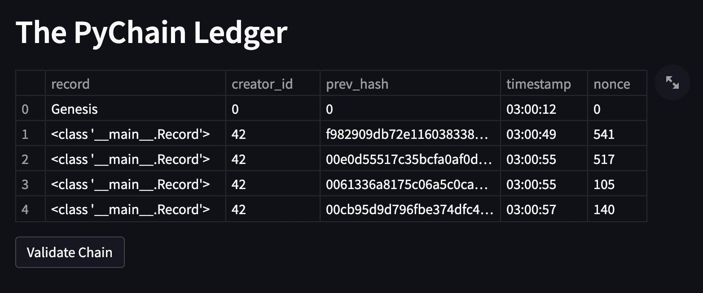
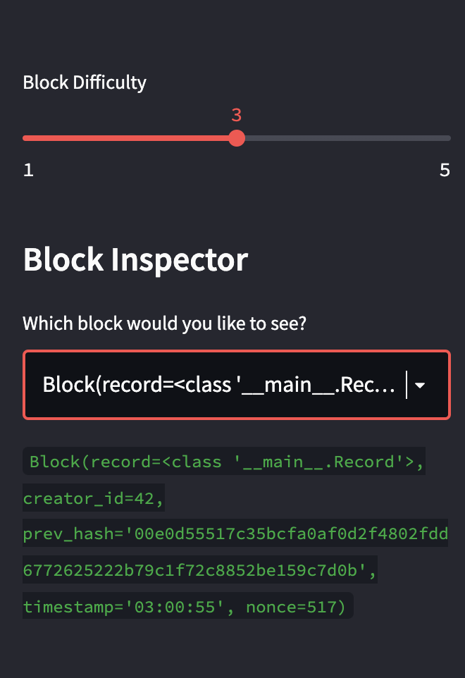
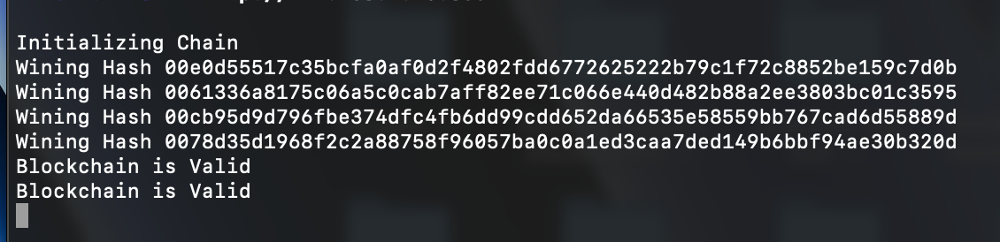

# Blockchain_Based_Ledger
Utilizing streamlit to a create a blockchain based ledger system. The user has the option to input sender, receiver, and amount information. As well as check the specific entry, and validate the blockchain. 

## Technologies

This project leverages python3 with the following packages:

* [numpy](https://numpy.org/doc/) - For arrays and math.

* [streamlit](https://docs.streamlit.io/library/get-started/installation) - For a blockchain interface. 

* [pandas](https://pandas.pydata.org/docs/) - For dataframs and csv reading.

* [hashlib](https://pypi.org/project/hashlib/) - Provides the hash algorithms. 

* [datetime](https://pypi.org/project/DateTime/) - For organizing timeseries data.  

* [dataclass](https://pypi.org/project/dataclasses/) - For the creation of data classes. 

* [typing](https://pypi.org/project/typing/) - Typing defines a standard notation for Python function and variable type annotations. 

---

## Installation Guide

pip install numpy
pip install hashlib
pip install pandas
pip install dataclass
pip install streamlit
pip install typing
pip install datetime

---

## Usage

Cd to the correct folder and run 'streamlit run pychain.py'. This will open a local host and from there the user can interact with the blockchain. The user can input sender, receiver, and amount information, then validate the blockchain and recieve a confirmation in their terminal.
---

## Images

---

## Contributors

Made by Owen Wardlaw : owardlaw@ucsd.edu.
---

## License

MIT
